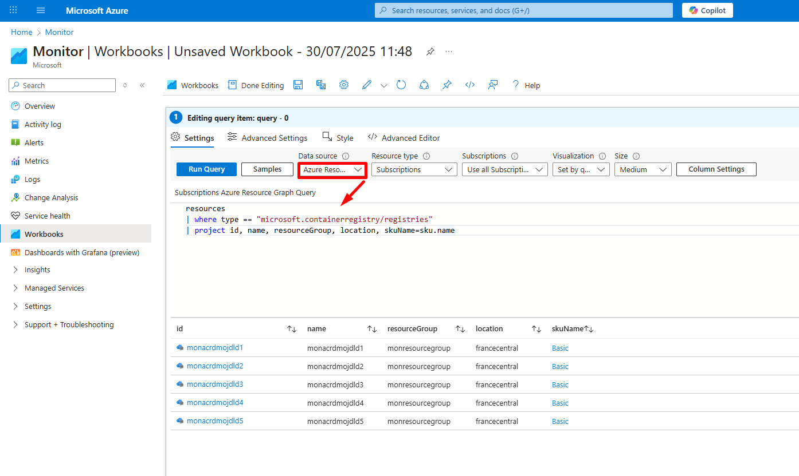
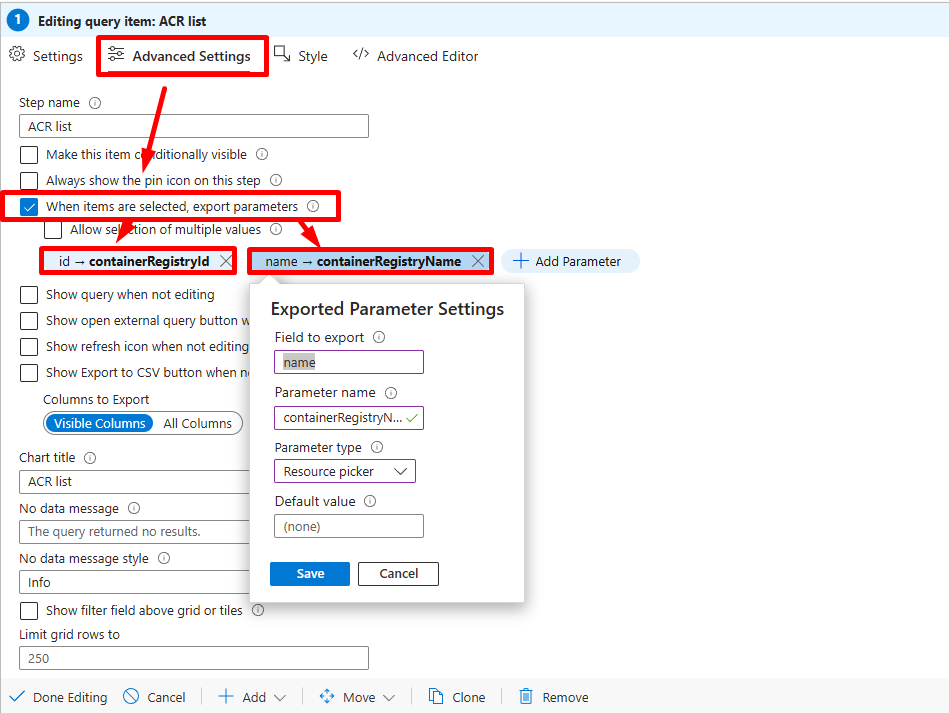
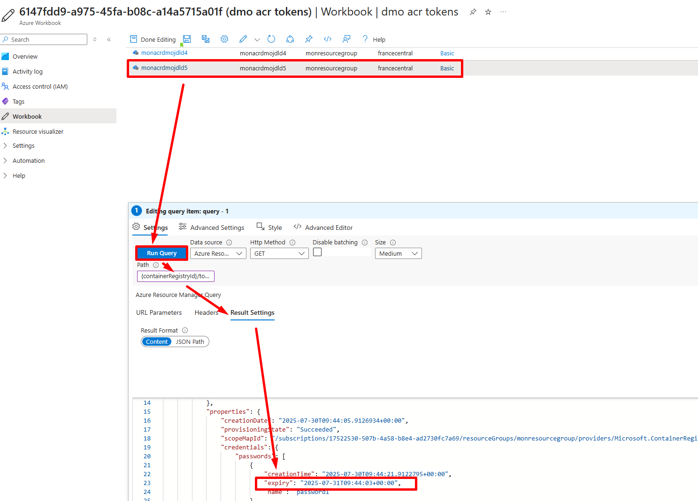
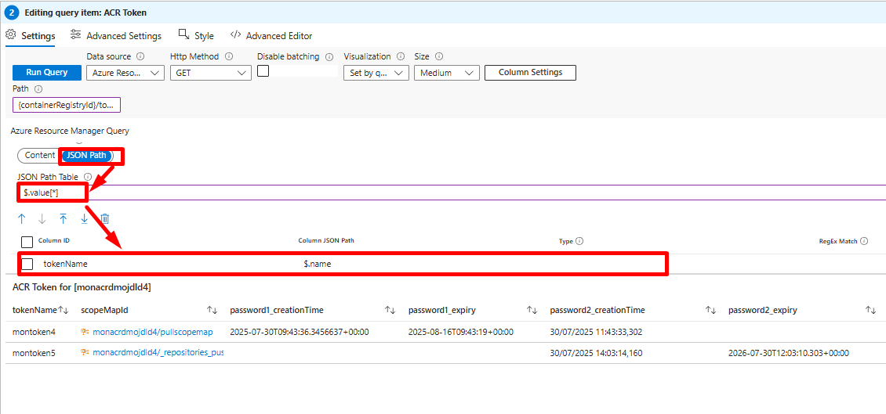
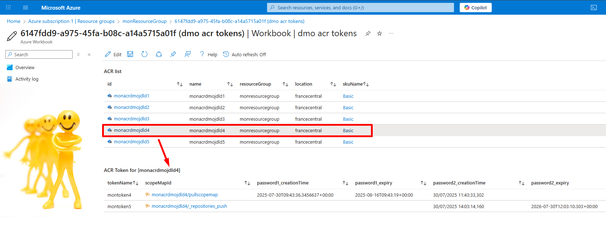

# Azure Workbook for ACR tokens and their expiration dates

## Introduction

In this article, we will see how to monitor [Azure Container Registry (ACR)](https://learn.microsoft.com/en-us/azure/container-registry/container-registry-authentication?WT.mc_id=AZ-MVP-5003548&tabs=azure-cli) tokens with their expiration dates.

We will demonstrate how to do this using the Azure REST API: [Registries - Tokens](https://learn.microsoft.com/en-us/rest/api/containerregistry/tokens/list?view=rest-containerregistry-2023-01-01-preview&WT.mc_id=AZ-MVP-5003548&tabs=HTTP) - List and an [Azure Workbook](https://learn.microsoft.com/en-us/azure/azure-monitor/visualize/workbooks-overview?WT.mc_id=AZ-MVP-5003548).

To obtain a list of Azure Container Registry (ACR) tokens and their expiration dates using the Azure Resource Manager API, we need to perform a series of REST API calls to authenticate and retrieve the necessary information. This process involves the following steps:

1. Authenticate and obtain an access token.
2. List ACR tokens.
3. Get token credentials and expiration dates.

## Example Bash Script

Here’s an example script that automates the process of obtaining ACR tokens and their expiration dates:

```bash
#!/bin/bash

# Azure AD application (service principal) credentials
CLIENT_ID="<CLIENT_ID>"
CLIENT_SECRET="<CLIENT_SECRET>"
TENANT_ID="<TENANT_ID>"

# Azure subscription and resource details
SUBSCRIPTION_ID="<SUBSCRIPTION_ID>"
RESOURCE_GROUP="<RESOURCE_GROUP>"
REGISTRY_NAME="<REGISTRY_NAME>"

# Authenticate and obtain the access token
ACCESS_TOKEN=$(curl -s -X POST -H "Content-Type: application/x-www-form-urlencoded" \
-d "grant_type=client_credentials&client_id=${CLIENT_ID}&client_secret=${CLIENT_SECRET}&scope=https://management.azure.com/.default" \
"https://login.microsoftonline.com/${TENANT_ID}/oauth2/v2.0/token" | jq -r .access_token)

# List ACR tokens and their credentials
curl -s -X GET -H "Authorization: Bearer ${ACCESS_TOKEN}" -H "Content-Type: application/json" \
"https://management.azure.com/subscriptions/${SUBSCRIPTION_ID}/resourceGroups/${RESOURCE_GROUP}/providers/Microsoft.ContainerRegistry/registries/${REGISTRY_NAME}/tokens?api-version=2023-01-01-preview" | jq .
```

## Azure Monitor Workbook

There is a simple way to call Azure APIs within Azure Workbooks with an embedded authentication method. It can be achieved with an Azure Workbook querying [Azure Resource Graph](https://learn.microsoft.com/en-us/azure/governance/resource-graph/samples/starter?WT.mc_id=AZ-MVP-5003548&tabs=azure-cli).

To create an empty workbook, navigate to [Azure Monitor → Workbook](https://portal.azure.com/#view/Microsoft_Azure_Monitoring/AzureMonitoringBrowseBlade/~/workbooks), select "**+ New**", click on "**+ Add**", select "**Add query**," and use "**Azure Resource Graph**" as the Data Source to query all your Azure Container Registries, as illustrated in the following screenshot.



You can copy/paste the following [Azure Resource Graph](https://learn.microsoft.com/en-us/azure/governance/resource-graph/samples/starter?WT.mc_id=AZ-MVP-5003548&tabs=azure-cli) query to print your Container Registries.

```KQL
resources
| where type == "microsoft.containerregistry/registries"
| project id, name, resourceGroup, location, skuName=sku.name
```

Go to "**Advanced Settings**", select "**When items are selected, export parameters**," and click on "**Add Parameter**," using the following specifications:

1. Field to export: **id** / Parameter name: **containerRegistryId** / Parameter Type: **Resource picker**
2. Field to export: **name** / Parameter name: **containerRegistryName** / Parameter Type: **Resource picker**

This will permit us to use as a parameter the Container Registry we will select/click on for the next query.

You can also from this panel give a "**Chart title**" to our chart → "**ACR list**" for example.



Now that we have our Azure Container registry, we will now be able to call our Azure REST API: [Registries - Tokens - List](https://learn.microsoft.com/en-us/rest/api/containerregistry/tokens/list?view=rest-containerregistry-2023-01-01-preview&WT.mc_id=AZ-MVP-5003548&tabs=HTTP).

Click on the "**+ Add**" icon, select "**+ Add query**", under Data source select "**Azure Resource Manager**".

Under Path we can concatenate the output of the previous query **{containerRegistryId}** with our API specifications, you can notice here that we don't need to precise the fully Microsoft API url when using "**Azure Resource Manager**" within workbooks →

```bash
{containerRegistryId}/tokens?api-version=2023-01-01-preview
```

If you now click on one **Azure Container Registry** from the previous table, click on "**Run Query**", the "**Result Settings**" panel you will see the content result of your API call revealing the Container Registry Tokens passwords.



The next part consists in drawing a nice table from the json received through API.

It can be achieved through the "**Result Settings**" panel, click on "**JSON Path**" and add the following specifications:

- JSON Path Table: **$.value[*]**
- Columns:
  - Column ID: **tokenName** / Column JSON Path: **$.name**
  - Column ID: **password1_creationTime** / Column JSON Path: **$.properties.credentials.passwords[?(@.name=='password1')].creationTime**
  - Column ID: **password1_expiry** / Column JSON Path: **$.properties.credentials.passwords[?(@.name=='password1')].expiry**
  - Column ID: **password2_creationTime** / Column JSON Path: **$.properties.credentials.passwords[?(@.name=='password2')].creationTime**
  - Column ID: **password2_expiry** / Column JSON Path: **$.properties.credentials.passwords[?(@.name=='password2')].expiry**



You can also from the "**Advanced Settings**" panel give a "**Chart title**" → "**ACR Token for [{containerRegistryName}]**" for example.

Click on "**Done Editing**" and save you workbook, you will now have a ready workbook from where you will view you ACR Tokens with their passwords properties.

The result looks like this



## Conclusion

Calling the Azure API via Azure Workbook demonstrates that we can retrieve any information we want.

See you in the Cloud

Jamesdld
